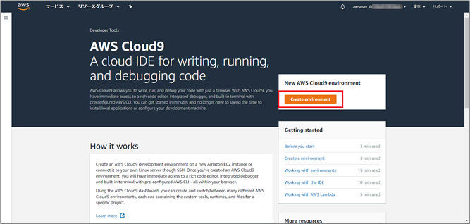
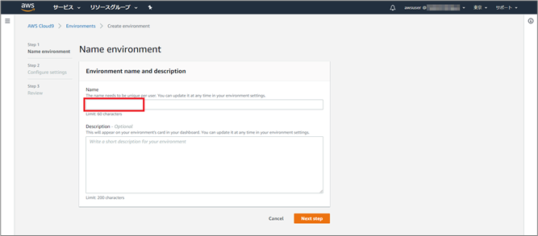
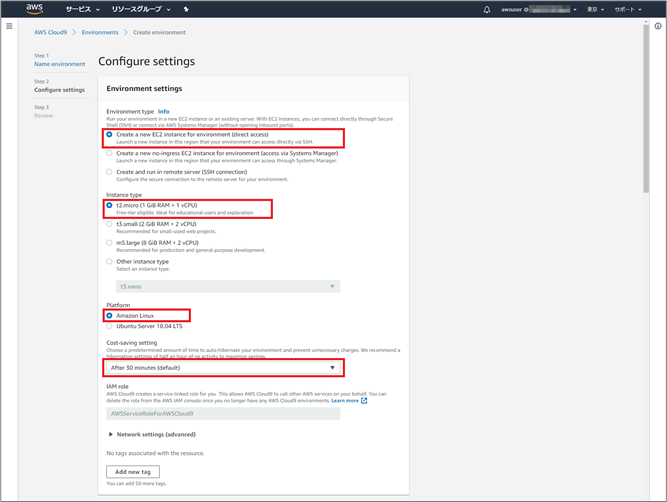
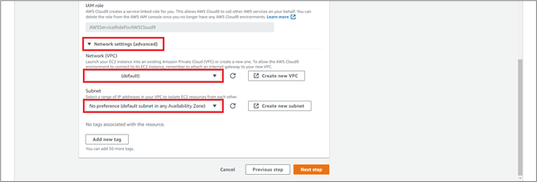
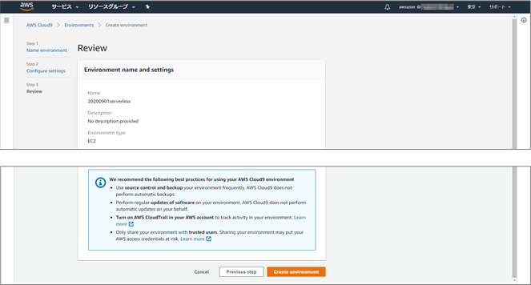
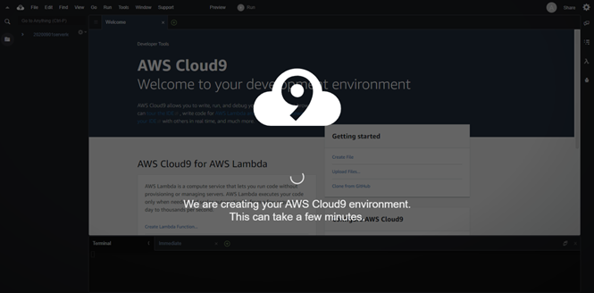
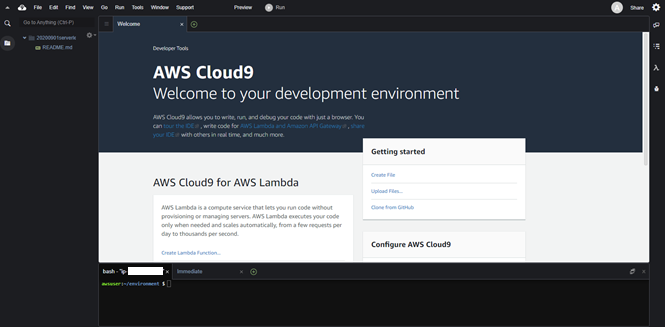

本日の ハンズオンで使用する Cloud9の環境を構築します。
Cloud9は、コードの記述・実行・デバッグが行えるクラウドベースの統合開発環境（IDE）です。
このハンズオンでは、EC2インスタンスを利用して新規にCloud9の環境を構築します。

なお、本資料は以下より一部引用して作成しました。
https://github.com/harunobukameda/AWS-Amplify-AWS-Lambda-Amazon-DynamoDB-AWS-API-Gateway-Amazon-Cognito
https://qiita.com/Keisuke69/items/af87eb8629ad4249bd22

## Cloud9環境の作成

### AWSマネジメントコンソールへのログイン

- AWS マネジメントコンソールにログインします。
- ログイン後、画面右上のヘッダー部のリージョン選択にて、東京リージョン となっていることを確認します。

### Cloud9環境の作成

- AWS マネジメントコンソールのサービス一覧から [Cloud9] を選択します。
- [Create environment] をクリックします。



- [Name] 欄に [PayPayDevEnv] と入力します。



- [Next Step] をクリックします。

- 以下のように設定します。（基本的にデフォルトのままで構いません）
* Environment type: [Create a new EC2 instance for environment (direct access)]
* Instance type: [t2.micro]
* Platform: [Amazon Linux]
* Cost-saving setting: [After 30 minutes] （アイドル状態が30分続くと自動的にEC2インスタンスを停止する設定です）
* IAM Role: [AWSServiceRoleForAWSCloud9]  (変更できません)



- [Network settings (advanced)] をクリックして展開します。
Cloud9環境を構築する VPC および サブネット を指定できますので、任意のVPCを指定してください。サブネットは「パブリックサブネット」であるものを指定してください。
不明な場合はデフォルトVPC（名前に「(default)」が付いたVPC）を選択すれば問題ありません。



- [Next Step] をクリックします。

- 確認画面になりますので、[Create environment] をクリックします。



- Cloud9環境の作成が始まります。完成まで数分間かかります。



- Cloud9環境が作成されました。




## Pythonのバージョンアップ

2021-04-28時点では、Pythonは3.7.9がインストールされているため、3.8を以下のコマンドでインストールしてください。

```
git clone https://github.com/jaws-ug-kanazawa/line-api-use-case-table-order.git
cd line-api-use-case-table-order/tools/
sudo sh install_python3.8.sh
```


## ディスク容量の拡張

Cloud9の初期EBSサイズは10GiBです。SAMを利用する際に10GBを超える容量のサイズが必要となるため、以下の方法にてEBSボリュームサイズを20GBに変更してください。

```
cd line-api-use-case-table-order/tools/
sh resize.sh 20
```

df -Hのコマンドを実行し、/dev/xvda1が20GiB(22GB)になっていることを確認してください。
```
Filesystem      Size  Used Avail Use% Mounted on
devtmpfs        497M     0  497M   0% /dev
tmpfs           516M     0  516M   0% /dev/shm
tmpfs           516M  566k  515M   1% /run
tmpfs           516M     0  516M   0% /sys/fs/cgroup
/dev/xvda1       22G   12G   11G  52% /
tmpfs           104M     0  104M   0% /run/user/1000
tmpfs           104M     0  104M   0% /run/user/0
```

[目次へ戻る](../README.md)
